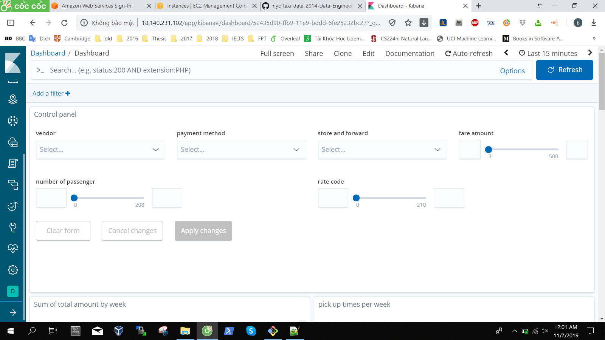
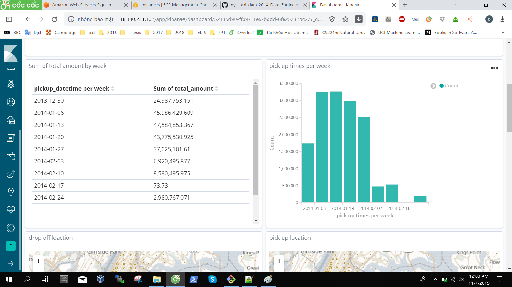
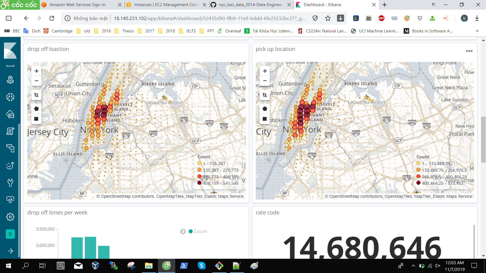
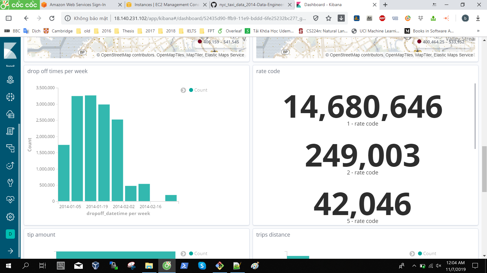
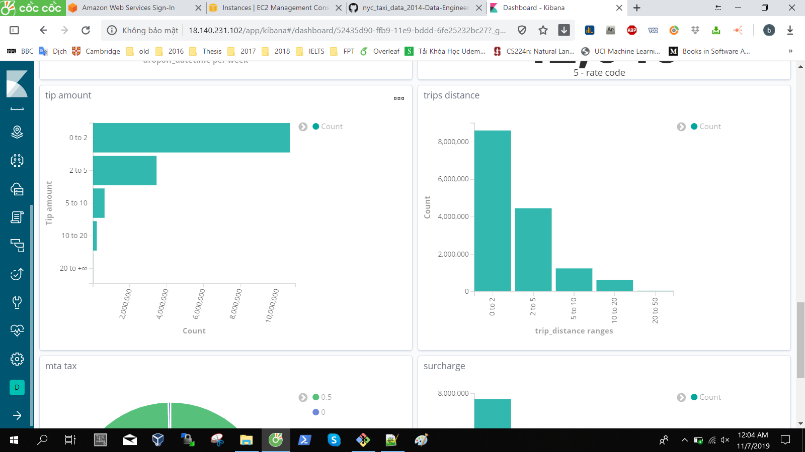
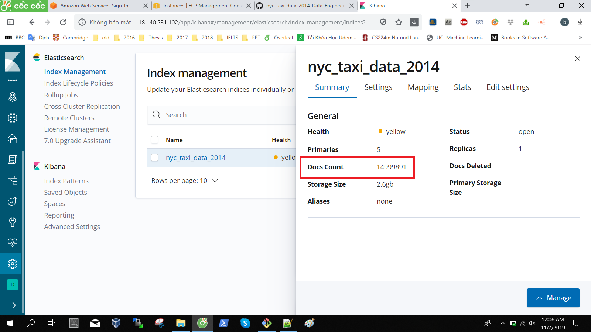

# Data
nyc_taxi_data_2014 contains only one table with the following fields: 
- vendor_id: category
- pickup_datetime: date
- dropoff_datetime: date 
- passenger_count: numeric/category
- trip_distance: numeric 
- pickup_longitude: numeric/geo_point 
- pickup_latitude: numeric/geo_point 
- rate_code: numeric/category
- store_and_fwd_flag: boolean 
- dropoff_longitude: numeric/geo_point 
- dropoff_latitude: numeric/geo_point 
- payment_type: category
- fare_amount: numeric
- surcharge: numeric 
- mta_tax: numeric/category
- tip_amount: numeric 
- tolls_amount: numeric
- total_amount numeric

# Data modeling
Elasticsearch is a NoSQL database and we can not execute ad-hoc queries to it, so data model must adapt to bussiness requirements. Howerver because of the simplicity of data struct, there are not much problem in data modeling needed to consider.

# Elasticsearch 

### Index mapping 
I had to specify index before running logstash to put data because I had not found out any way to map location to geo_point data type automatically.

Index in the file `elasticsearch-index.txt`

# Logstash 

### Configuration
Configuration in the file `nyc_taxi_data_2014-logstash.conf`

# Kibana
There are some images of the dashboard:














# Issue 1
There is an issue. That is converting `pickup_location` or `dropoff_location`. If the source value could not be converted to `float`, the destination value could be abnomal or If latitude or logtitude is greater than or equal 180 or slower than or euqual -180, errors will occur. 

```
[2019-11-05T07:31:23,515][WARN ][logstash.outputs.elasticsearch] Could not index event to Elasticsearch. {:status=>400, :action=>["index", {:_id=>nil, :_index=>"nyc_taxi_data_2014", :_type=>"doc", :routing=>nil}, #<LogStash::Event:0xe45b26>], :response=>{"index"=>{"_index"=>"nyc_taxi_data_2014", "_type"=>"doc", "_id"=>"VO95Om4B6PHSiacoribN", "status"=>400, "error"=>{"type"=>"mapper_parsing_exception", "reason"=>"failed to parse field [dropoff_location] of type [geo_point]", "caused_by"=>{"type"=>"parse_exception", "reason"=>"latitude must be a number"}}}}}
```

```
[2019-11-05T08:41:25,839][WARN ][logstash.outputs.elasticsearch] Could not index event to Elasticsearch. {:status=>400, :action=>["index", {:_id=>nil, :_index=>"nyc_taxi_data_2014", :_type=>"doc", :routing=>nil}, #<LogStash::Event:0xb2f94a0>], :response=>{"index"=>{"_index"=>"nyc_taxi_data_2014", "_type"=>"doc", "_id"=>"6Ta5Om4B6PHSiacozogw", "status"=>400, "error"=>{"type"=>"mapper_parsing_exception", "reason"=>"failed to parse field [dropoff_location] of type [geo_point]", "caused_by"=>{"type"=>"illegal_argument_exception", "reason"=>"illegal longitude value [-775.416665] for dropoff_location"}}}}}
```

I tried to edit elasticsearch index to be toleranced with abnormal data:

```
"dropoff_location":{ 
	"type":"geo_point",
	"ignore_malformed": true
}
```

The issue was still not solved.

Also, I tried to use if condition in logstash configuration to replace all abnomal latitude or longitude to zero. But in the case that source value can not be converted to `float`, an other error occured. 

I found out that `ruby filter` would solve this issue, but because of lacking time, I could not try.

This issue has not been solved yet.


Because of this issue, the data is missed 108 records.

# Issue 2
Because of the too big volumn of data, I could not add script field that equal difference between `pickup_datetime` and `dropoff_datetime`. This action would consume a lot of computation resource.